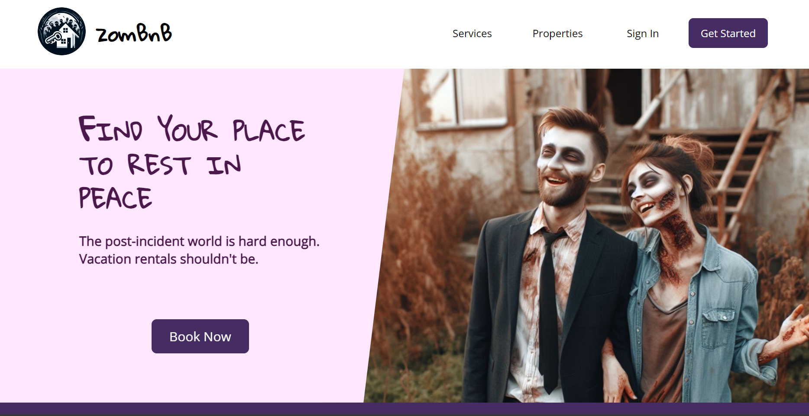
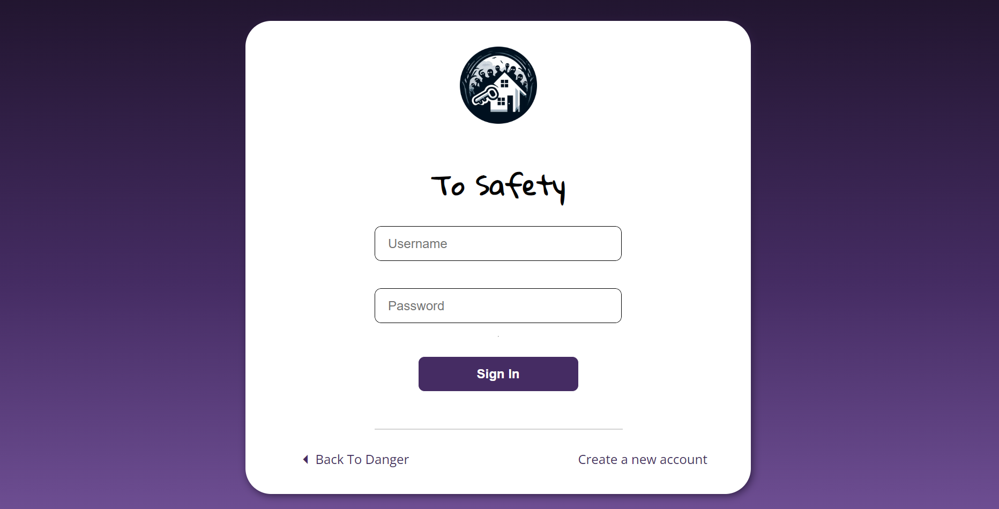

# zomBnB
## Rest In Peace...ful Serenity!

  
Showcasing undead-friendly lodgings for all your post apocalyptic needs!
  
This is a dummy React app built alongside a classmate as practice for implementing rudimentary authentication. The site is hosted on PythonAnywhere with a Flask backend.
  
It was designed for 1080p screens and the layout hasn't gotten a responsive design pass. I know, I know... if I find some extra time I see about tidying things up.

## Content

  
This is a pretty barebones project. Most of our time was spent on handling auth and token management. You'll see a basic login, a create account page, and a "profile" page that lets you know if you've successfully logged in.
  
On the wishlist: adding information to the profile page, an edit account page, account deletion, and filling out dummy pages with silly content.
 

[You can visit our site here.](https://zombnb.serocha.com)